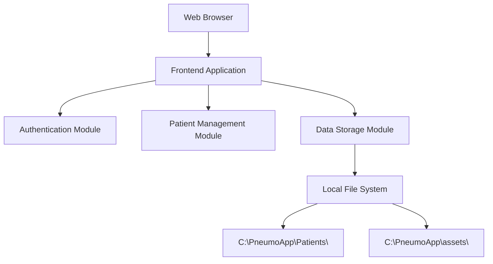

# Design Document

## Overview

The Patient Management System will be implemented as a local web application using modern web technologies that can run entirely offline. The application will use a client-side architecture with local file system storage, ensuring complete data privacy and independence from internet connectivity. The system will be built using HTML5, CSS3, and JavaScript with a focus on simplicity, security, and reliability.

## Architecture

### High-Level Architecture



### Technology Stack

- **Frontend Framework**: Vanilla JavaScript with modern ES6+ features
- **UI Framework**: Custom CSS with responsive design principles
- **Data Storage**: JSON files stored locally using File System Access API (with fallback to localStorage)
- **Authentication**: Session-based with local credential storage
- **Build Tool**: Simple HTML/CSS/JS structure for easy deployment
- **Server**: Local HTTP server (Python's http.server or Node.js serve) for development

### Deployment Model

The application will be packaged as a standalone web application that can be:

1. Served locally using a simple HTTP server
2. Opened directly in a browser (with some limitations)
3. Packaged as an Electron app for native desktop experience (optional future enhancement)

## Components and Interfaces

### 1. Authentication Component

**Purpose**: Manages user login and session state

**Key Features**:

- Simple credential validation against stored hash
- Session management using sessionStorage
- Automatic logout on browser close
- Logo display integration

**Interface**:

```javascript
class AuthenticationManager {
    login(username, password)
    logout()
    isAuthenticated()
    getCurrentUser()
}
```

### 2. Patient Management Component

**Purpose**: Handles all patient-related operations

**Key Features**:

- CRUD operations for patient records
- Search functionality with fuzzy matching
- Form validation and data sanitization
- Change tracking for unsaved modifications

**Interface**:

```javascript
class PatientManager {
    createPatient(patientData)
    getPatient(patientId)
    updatePatient(patientId, patientData)
    deletePatient(patientId)
    searchPatients(searchTerm)
    getAllPatients()
}
```

### 3. Data Storage Component

**Purpose**: Manages local data persistence and file operations

**Key Features**:

- JSON-based file storage
- Automatic backup creation
- Data integrity validation
- Directory structure management

**Interface**:

```javascript
class DataStorageManager {
    savePatient(patientData)
    loadPatient(patientId)
    deletePatient(patientId)
    searchPatients(criteria)
    createBackup()
    initializeStorage()
}
```

### 4. UI Router Component

**Purpose**: Manages navigation between different views

**Key Features**:

- Single Page Application (SPA) routing
- View state management
- URL hash-based navigation
- Unsaved changes detection

**Interface**:

```javascript
class UIRouter {
    navigateTo(route, params)
    getCurrentRoute()
    registerRoute(path, handler)
    checkUnsavedChanges()
}
```

### 5. Form Management Component

**Purpose**: Handles form rendering, validation, and state management

**Key Features**:

- Dynamic form generation
- Real-time validation
- Change tracking
- Auto-save capabilities (optional)

**Interface**:

```javascript
class FormManager {
    renderForm(formConfig, data)
    validateForm(formData)
    trackChanges(formElement)
    hasUnsavedChanges()
    saveForm()
}
```

## Data Models

### Patient Data Model

```javascript
const PatientSchema = {
  id: "string", // UUID generated
  firstName: "string",
  lastName: "string",
  dateOfBirth: "date",
  age: "number", // calculated field
  placeOfResidence: "string",
  gender: "enum", // ['male', 'female', 'other']
  visits: [
    {
      visitDate: "date",
      medications: "string",
      observations: "string",
      additionalComments: "string",
    },
  ],
  createdAt: "timestamp",
  updatedAt: "timestamp",
};
```

### User Session Model

```javascript
const SessionSchema = {
  userId: "string",
  username: "string",
  loginTime: "timestamp",
  lastActivity: "timestamp",
  isAuthenticated: "boolean",
};
```

### Application Configuration Model

```javascript
const ConfigSchema = {
  dataDirectory: "string",
  assetsDirectory: "string",
  logoPath: "string",
  backupEnabled: "boolean",
  autoSaveInterval: "number",
};
```

## Error Handling

### Error Categories

1. **Authentication Errors**

   - Invalid credentials
   - Session timeout
   - Access denied

2. **Data Storage Errors**

   - File system access denied
   - Disk space insufficient
   - Data corruption
   - File not found

3. **Validation Errors**

   - Required field missing
   - Invalid data format
   - Duplicate patient records

4. **Network Errors** (if using local server)
   - Server unavailable
   - Connection timeout

### Error Handling Strategy

```javascript
class ErrorHandler {
  handleError(error, context) {
    // Log error for debugging
    console.error(`Error in ${context}:`, error);

    // Display user-friendly message
    this.showUserMessage(this.getUserFriendlyMessage(error));

    // Attempt recovery if possible
    this.attemptRecovery(error, context);
  }

  getUserFriendlyMessage(error) {
    // Map technical errors to user-friendly messages
  }

  attemptRecovery(error, context) {
    // Implement recovery strategies
  }
}
```

### User Feedback

- **Success Messages**: Green toast notifications for successful operations
- **Error Messages**: Red toast notifications with clear, actionable messages
- **Warning Messages**: Yellow notifications for potential issues
- **Loading States**: Progress indicators for file operations

## Testing Strategy

### Unit Testing

**Framework**: Jest or similar lightweight testing framework

**Test Coverage**:

- Data validation functions
- Patient CRUD operations
- Search functionality
- Authentication logic
- File system operations (mocked)

### Integration Testing

**Scope**:

- End-to-end user workflows
- Data persistence across sessions
- Form submission and validation
- Navigation between views

### Manual Testing

**Test Scenarios**:

1. **Patient Lifecycle**: Create → Search → View → Edit → Delete
2. **Authentication Flow**: Login → Use application → Logout with/without changes
3. **Data Persistence**: Save data → Close application → Reopen → Verify data
4. **Error Scenarios**: Invalid inputs, file system errors, network issues
5. **Browser Compatibility**: Test on Chrome, Firefox, Edge

### Performance Testing

**Metrics to Monitor**:

- Application startup time
- Search response time with large datasets
- File save/load operations
- Memory usage during extended sessions

### Security Testing

**Security Considerations**:

- Input sanitization and XSS prevention
- Local storage security
- Session management
- File system access permissions

## Implementation Phases

### Phase 1: Core Infrastructure

- Set up project structure
- Implement basic authentication
- Create data storage foundation
- Build basic UI framework

### Phase 2: Patient Management

- Implement patient CRUD operations
- Build patient form interface
- Add search functionality
- Implement data validation

### Phase 3: Advanced Features

- Add logout confirmation with unsaved changes
- Implement backup system
- Add logo and branding
- Enhance error handling

### Phase 4: Polish and Testing

- Comprehensive testing
- Performance optimization
- UI/UX improvements
- Documentation

## Security Considerations

### Data Protection

- All patient data stored locally only
- No network transmission of sensitive data
- File system permissions properly configured
- Input sanitization to prevent injection attacks

### Authentication Security

- Password hashing using bcrypt or similar
- Session timeout implementation
- Secure session storage
- Protection against brute force attacks

### File System Security

- Restricted file access permissions
- Data validation before file operations
- Backup file encryption (optional)
- Secure deletion of sensitive files

## Performance Optimization

### Client-Side Optimization

- Lazy loading of patient records
- Efficient search algorithms
- Minimal DOM manipulation
- CSS and JavaScript minification

### Data Management

- Indexed patient data for fast searches
- Pagination for large patient lists
- Efficient file I/O operations
- Memory management for large datasets

### User Experience

- Responsive design for different screen sizes
- Keyboard shortcuts for common operations
- Auto-save functionality (optional)
- Offline-first design principles
